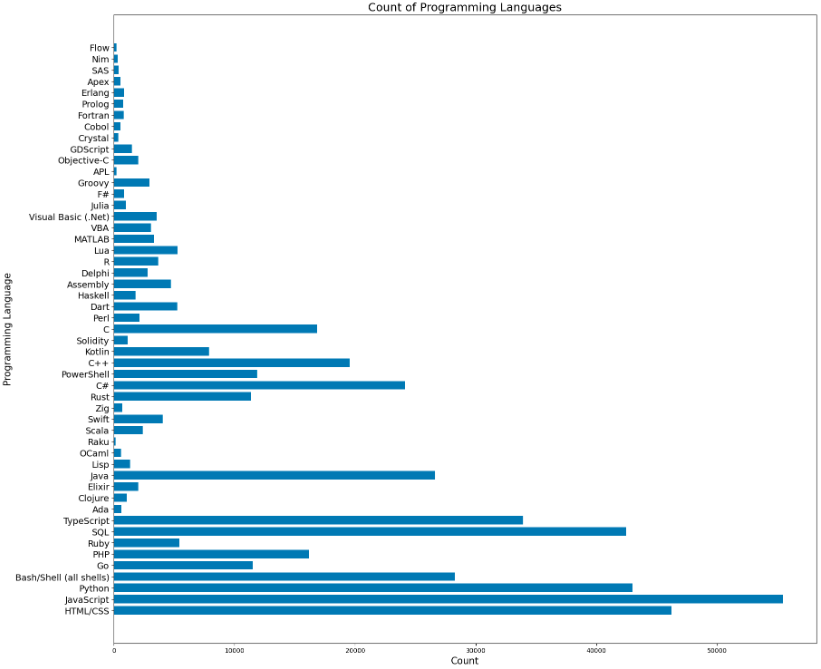
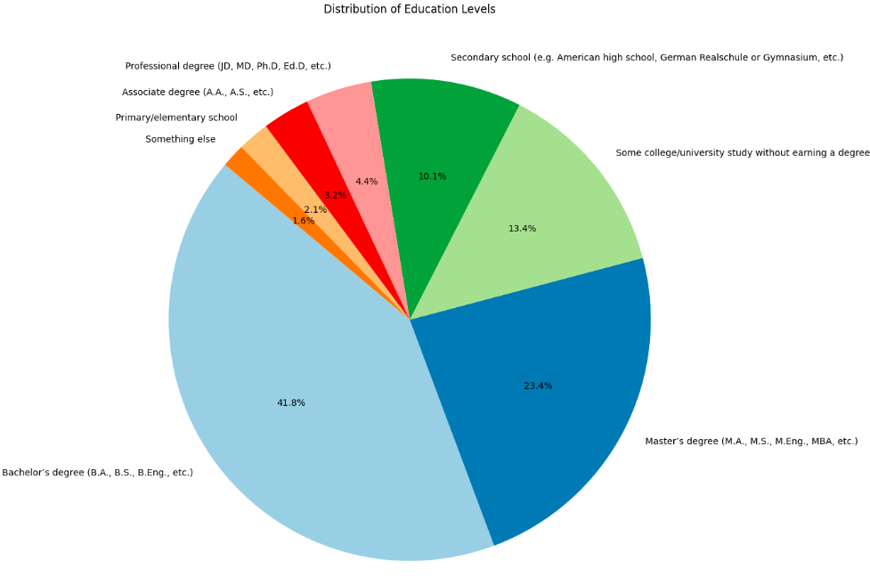

## დიაგრამა N1

პირველ დიაგრამაზე მოცემულია იმ პროგრამირების ენების რაოდენობა, რომლებთანაც გამოკითხულებს შეხება ჰქონიათ.

## დიაგრამა N2

მეორე წრიულ დიაგრამაზე მოცემულია გამოკითხულებთა რამდენ პროცენტს რა ტიპის განათლება აქვს მიღებული

